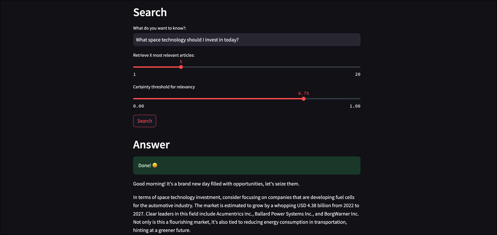

LLMOps: Automatic retrieval-augmented generation with Airflow, GPT-4 and Weaviate
=================================================================================

This repository contains the DAG code used in the [LLMOps: Automatic retrieval-augmented generation with Airflow, GPT-4 and Weaviate](https://docs.astronomer.io/learn/use-case-airflow-llm-rag-finance) use case. The pipeline was modelled after the [Ask Astro reference architecture](https://github.com/astronomer/ask-astro).

The DAGs in this repository use the following tools:

- [Weaviate Airflow provider](https://registry.astronomer.io/providers/apache-airflow-providers-weaviate/versions/latest)
- [Streamlit](streamlit.io)
- [Weaviate](weaviate.io)
- [FinBERT](https://huggingface.co/ProsusAI/finbert)
- [OpenAI GPT-4](https://platform.openai.com/docs/api-reference)

# How to use this repository

This section explains how to run this repository with Airflow. Note that you will need to copy the contents of the `.env_example.txt` file to a newly created `.env` file and add your own credentials.

The following credentials are necessary to use this repository:

- Alpha Vantage API key: available for free at [Alpha Vantage](https://www.alphavantage.co/support/#api-key).
- OpenAI API key, see the [OpenAI API documentation](https://platform.openai.com/docs/api-reference).

1. Run `git clone https://github.com/astronomer/use-case-airflow-llm-rag-finance.git` on your computer to create a local clone of this repository.
2. Install the Astro CLI by following the steps in the [Astro CLI documentation](https://docs.astronomer.io/astro/cli/install-cli). Docker Desktop/Docker Engine is a prerequisite, but you don't need in-depth Docker knowledge to run Airflow with the Astro CLI.
3. Create the `.env` file with the contents from `.env_example.txt` plus your own credentials.
4. Run `astro dev start` in your cloned repository.
5. After your Astro project has started. View the Airflow UI at `localhost:8080`, the Weaviate endpoint at `localhost:8081` and the Streamlit app at `localhost:8501`.
6. In order to fill the local Weaviate instance with data, run the `finbuddy_load_news` DAG to get the latest news articles or the `finbuddy_load_pre_embedded` DAG to load a set of preembedded (with ada-200) articles for quick development.
7. After the DAGrun has completed, ask a question about current financial developments in the Streamlit app at `localhost:8501`.

Note that if you switch between using OpenAI and local embeddings you will need to run the `create_schema` DAG to delete the old schema and create a new one because the two models create embeddings of different dimensions.

## Resources

- [LLMOps: Automatic retrieval-augmented generation with Airflow, GPT-4 and Weaviate](https://docs.astronomer.io/learn/use-case-airflow-llm-rag-finance) use case.
- [Orchestrate Weaviate operations with Apache Airflow](https://docs.astronomer.io/learn/airflow-weaviate).
- Ask Astro reference architecture:
    - [Ask Astro](https://docs.astronomer.io/learn/airflow-weaviate)
    - [Source code](https://github.com/astronomer/ask-astro)
- [Create dynamic Airflow tasks](https://docs.astronomer.io/learn/dynamic-tasks).
- [Introduction to the TaskFlow API and Airflow decorators](https://docs.astronomer.io/learn/airflow-decorators).